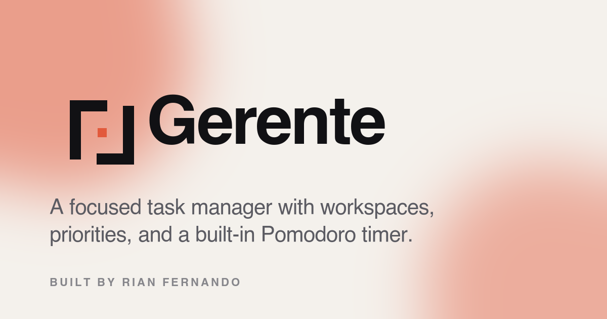

<div align="center">



# Gerente

**A focused task manager with workspaces, priorities, and a built-in Pomodoro timer.**

[**Live demo →**](https://gerente.rianfernando.com) · [Architecture decisions](docs/decisions.md) · [Built by Rian Fernando](https://rianfernando.com)


</div>

---

## What it is

Gerente (Portuguese for *manager*) is a task app that gets out of the way. It runs entirely in the browser, installs as a PWA, works offline, and optionally syncs to the cloud once you sign in. Designed as a portfolio piece to show full-stack range without the bloat of a contrived demo.

## Why it's interesting

- **Offline-first, online-optional.** Without an account, tasks live in `localStorage` and the app works zero-network. Sign in, and tasks transparently migrate to Supabase with realtime cross-device sync.
- **Row-Level Security from day one.** Auth is wired with Supabase RLS policies, so each user's rows are isolated at the database layer — not just the application layer.
- **Real PWA, not a fake one.** Service worker precaches the shell, browser tabs install the app on desktop and mobile, and a built-in update toast prompts a reload when new builds ship.
- **Brand-aware UI.** Custom Pivot wordmark, Apple-style glass surfaces, light/dark adaptive favicon, and a real OG card so it unfurls cleanly on LinkedIn / Twitter / Slack.

## Stack

| Layer | Tech |
|---|---|
| UI | React 19, react-router-dom 7 |
| Build | Vite 8, Vitest, vite-plugin-pwa |
| State | React hooks + `localStorage` (signed out) / Supabase Postgres (signed in) |
| Auth | Supabase email/password + GitHub OAuth |
| Drag & drop | `@hello-pangea/dnd` (React 19-compatible fork of react-beautiful-dnd) |
| Hosting | Vercel (custom subdomain, auto-deploy from `main`) |
| Database | Supabase Postgres + RLS + realtime |
| CI | GitHub Actions (tests + build on every push) |

## Features

- Workspaces (Personal / Work / School / Fitness / Other) with task counts in the segmented tab bar
- High / Medium / Low priority with colored left-edge accents
- Due dates with Overdue / Due Today / Due Soon visual states
- Drag-and-drop reordering within a workspace
- Built-in Pomodoro timer that updates the browser tab title with the countdown
- Light / dark mode with persistence
- Keyboard shortcuts (press `?` to see them)
- Installable PWA with offline shell
- Optional cross-device sync via Supabase

## Architecture at a glance

```
                   ┌────────────────────────┐
                   │   gerente.rianfernando  │
                   │         .com           │
                   └───────────┬────────────┘
                               │
                          ┌────▼─────┐
                          │  Vercel  │  static SPA + auto-deploy from main
                          └────┬─────┘
                               │
              ┌────────────────▼────────────────┐
              │      React 19 + Vite 8          │
              │  ┌────────────┐ ┌────────────┐  │
              │  │ Service    │ │ React      │  │
              │  │ Worker     │ │ Router 7   │  │
              │  │ (Workbox)  │ │            │  │
              │  └────────────┘ └─────┬──────┘  │
              └──────────────────────┼──────────┘
                                     │
                  ┌──────────────────┴──────────────────┐
                  │                                     │
            signed out                            signed in
                  │                                     │
            ┌─────▼──────┐                       ┌──────▼─────┐
            │ localStorage│                      │  Supabase  │
            │             │                      │  Postgres  │
            └─────────────┘                      │  + RLS     │
                                                 │  + realtime│
                                                 └────────────┘
```

See [docs/decisions.md](docs/decisions.md) for the reasoning behind each choice.

## Project layout

```
src/
├── components/
│   ├── auth/        Sign-in sheet + header avatar menu
│   ├── brand/       GerenteLogo (primary / mono / mono-accent / reverse / lockup)
│   ├── pwa/         Service-worker update prompt
│   ├── sort/        Sort dropdown
│   ├── summary/     Top-of-page stats dashboard
│   └── workspace/   Segmented workspace tabs
├── hooks/
│   ├── useAuth.js          Session + sign-in/up/out
│   ├── useTaskManager.js   Cloud + local mode with optimistic writes + realtime
│   ├── useLocalStorage.js  Generic persisted state
│   ├── useToast.js         Lightweight toast queue
│   └── useDocumentMeta.js  Per-route title / description / canonical / robots
├── features/        Pure logic (sorting, dark-mode bootstrap)
├── lib/supabase.js  Supabase client (gracefully no-op when env vars missing)
└── pages/           NotFound (the rest renders inside App.jsx routes)
supabase/schema.sql  Tasks table + RLS policies + realtime publication
scripts/             Reproducible asset builders (OG image)
```

## Run it locally

```bash
git clone https://github.com/Rian-Fernando/Gerente.git
cd Gerente
npm install
npm run dev
```

Opens at `http://localhost:3000`. The app fully works without any env vars — `localStorage` mode kicks in.

**To enable cloud sync locally:**

```bash
cp .env.example .env.local
# Fill in VITE_SUPABASE_URL and VITE_SUPABASE_PUBLISHABLE_KEY
```

Then run [`supabase/schema.sql`](supabase/schema.sql) in your Supabase project's SQL editor (creates the `tasks` table + RLS policies).

## Scripts

| | |
|---|---|
| `npm run dev` | Vite dev server |
| `npm run build` | Production build (PWA, manifest, sitemap, OG card) |
| `npm run preview` | Serve the production build locally |
| `npm test` | Run Vitest suite (single pass) |
| `npm run test:watch` | Vitest watch mode |
| `./scripts/build-og-image.sh` | Regenerate the 1200×630 social card |

## License

[MIT](LICENSE) © Rian Fernando

---

<sub>Built by <a href="https://rianfernando.com" rel="author">Rian Fernando</a> · <a href="https://github.com/Rian-Fernando/Gerente">Source</a> · <a href="https://gerente.rianfernando.com">Live</a></sub>
