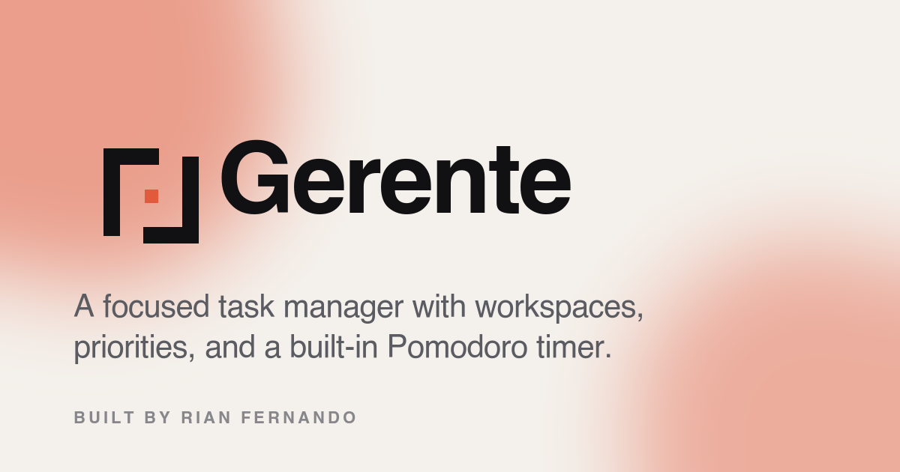
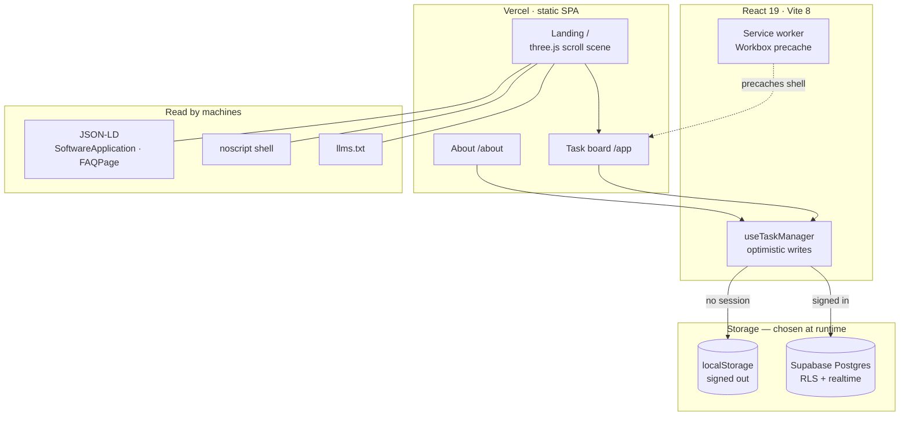

# Gerente — Focused Task Management

A task manager that gets out of the way. Tasks are grouped into **workspaces**, ranked by
**priority**, given **due dates**, dragged into the order you intend to work them — and then
worked through with a **built-in Pomodoro timer**, so the plan for the day and the focus
session live in the same place. It runs offline in the browser and syncs across devices only
if you ask it to.

[](https://github.com/Rian-Fernando/Gerente/actions/workflows/ci.yml)
[](https://github.com/Rian-Fernando/Gerente/actions/workflows/codeql.yml)
[](LICENSE)
[](#privacy--data)
[](https://gerente.rianfernando.com)

**▶ Live: [gerente.rianfernando.com](https://gerente.rianfernando.com)** · [Task board](https://gerente.rianfernando.com/app) · [Architecture decisions](docs/decisions.md)



## Why it's built this way

Most task apps solve capture and stop there — you end up with a tidy list and no mechanism
for actually doing the work. Gerente treats the timer as a first-class part of the model: a
Pomodoro session belongs to **one specific task**, and the countdown is written into the
browser tab title so it keeps working while you are somewhere else entirely.

The second decision is that an account is optional and *late*. Signed out, tasks live in
`localStorage` and never leave the device; the app is fully functional with no network and no
environment variables. Signing in migrates the same data to Postgres and turns on realtime
cross-device sync. Nothing is gated behind the account — it only adds sync.

## Architecture


```mermaid
flowchart TB
  subgraph Edge["Vercel · static SPA"]
    L["Landing /<br/>three.js scroll scene"]
    A["Task board /app"]
    B["About /about"]
  end
  subgraph Browser["React 19 · Vite 8"]
    H["useTaskManager<br/>optimistic writes"]
    SW["Service worker<br/>Workbox precache"]
  end
  subgraph Storage["Storage — chosen at runtime"]
    LS[("localStorage<br/>signed out")]
    DB[("Supabase Postgres<br/>RLS + realtime")]
  end
  subgraph Discover["Read by machines"]
    J["JSON-LD<br/>SoftwareApplication · FAQPage"]
    N["noscript shell"]
    T["llms.txt"]
  end

  L --> A --> H
  B --> H
  H -->|no session| LS
  H -->|signed in| DB
  SW -.precaches shell.-> A
  L --- J
  L --- N
  L --- T
```

Storage is picked at runtime from the session, not at build time, so the same bundle serves
both the anonymous and the signed-in experience.

## What it does

- **Workspaces** — Personal, Work, School, Fitness and Other, each with a live count of what
  is still open, so a busy week in one area never buries the rest.
- **Priorities** — High / Medium / Low, rendered as a coloured left edge on the row.
- **Due dates** — tasks move themselves into Due Soon, Due Today and Overdue states.
- **Drag-and-drop ordering** — arrange a workspace in the order you intend to work it.
- **Pomodoro timer** — a 25-minute session bound to one task, mirrored into the tab title.
- **Summary dashboard** — open, overdue and completed counts for the current workspace.
- **Offline PWA** — installs to the dock or home screen, works with no network, and prompts
  to reload when a new build ships.
- **Optional cloud sync** — Supabase auth (email/password or GitHub) with realtime updates.
- **Keyboard shortcuts** — `?` for the list, `D` for dark mode, `Space` to run the timer.

## The landing page

`/` is a scroll-driven three.js scene rather than a screenshot. It runs the product's own
story in four beats — the loose backlog, cards sorting into workspace columns, one card
lifting out with a Pomodoro ring closing around it, and the board settling once it is done —
on a keyframed camera path with instanced geometry and a bloom pass that peaks as the timer
completes.

It degrades honestly: `prefers-reduced-motion` gets one still frame and all four captions at
once, no WebGL gets a CSS gradient, and the whole scene is code-split so the task board never
downloads three.js at all.

## Privacy & data

| Mode | Where tasks live | Leaves your device |
|---|---|---|
| Signed out (default) | Browser `localStorage` | Never |
| Signed in (optional) | Supabase Postgres, row-level security | Only your own rows |

Row-level security policies are enforced at the database layer, not in application code, so
an account can only ever read and write rows it owns. See
[`supabase/schema.sql`](supabase/schema.sql).

## Built for machines too

The site is written to be quotable by AI answer engines, not just indexed:
[`/llms.txt`](public/llms.txt) carries a factual summary in the
[llms.txt convention](https://llmstxt.org); `robots.txt` names and allows the major AI
crawlers explicitly; `SoftwareApplication` and `FAQPage` JSON-LD plus a `<noscript>` content
shell are generated at build time from
[`src/constants/siteInfo.js`](src/constants/siteInfo.js), so the structured data and the
visible copy cannot drift apart. `src/seo.test.js` holds all of it to CI.

## Stack

| Layer | Tech |
|---|---|
| UI | React 19, react-router-dom 7 |
| 3D | three.js (landing scene, code-split) |
| Build | Vite 8, Vitest, vite-plugin-pwa |
| State | React hooks + `localStorage` (signed out) / Supabase Postgres (signed in) |
| Auth | Supabase email/password + GitHub OAuth |
| Drag & drop | `@hello-pangea/dnd` (React 19-compatible fork of react-beautiful-dnd) |
| Database | Supabase Postgres + RLS + realtime |
| Hosting | Vercel (custom subdomain, auto-deploy from `main`) |
| Feedback | [Feedex](https://feedex.rianfernando.com) widget, embedded at build time |
| CI | GitHub Actions — tests, build, CodeQL, IndexNow |

## Run it

```bash
npm install
npm run dev        # http://localhost:3000
```

The app is fully functional with no env vars — `localStorage` mode kicks in automatically.

**To enable cloud sync locally:**

```bash
cp .env.example .env.local
# Fill in VITE_SUPABASE_URL and VITE_SUPABASE_PUBLISHABLE_KEY
```

Then run [`supabase/schema.sql`](supabase/schema.sql) in your Supabase project's SQL editor
to create the `tasks` table and its RLS policies.

## Project structure

```
src/
  pages/Landing.jsx            scroll story, features, FAQ — the public front door
  components/landing/          three.js scene (keyframed camera, instanced cards)
  components/                  task input, list, Pomodoro, workspaces, auth, PWA prompt
  hooks/useTaskManager.js      cloud + local mode with optimistic writes and realtime
  hooks/useDocumentMeta.js     per-route title / description / canonical / robots
  helpers/formatDate.js        local-timezone date parsing, formatting and comparison
  constants/siteInfo.js        one source of truth for all public-facing copy
  features/                    pure logic (sorting, dark-mode bootstrap)
  workflow.test.jsx            the task flow end to end, driven through the real UI
  seo.test.js                  CI guard for robots, llms.txt, sitemap, FAQ, redirects
scripts/
  seo-html-plugin.js           builds head metadata, JSON-LD and the noscript shell
  feedex-plugin.js             embeds the Feedex feedback widget when a key is set
  indexnow.mjs                 instant-indexing ping on production deploys
  build-og-image.sh            regenerates the 1200×630 social card
supabase/schema.sql            tasks table + RLS policies + realtime publication
```

## Scripts

| | |
|---|---|
| `npm run dev` | Vite dev server |
| `npm run build` | Production build (PWA, manifest, JSON-LD, social card) |
| `npm run preview` | Serve the production build locally |
| `npm test` | Vitest suite, single pass |
| `npm run test:watch` | Vitest watch mode |
| `npm run indexnow` | Submit sitemap URLs to IndexNow by hand |
| `./scripts/build-og-image.sh` | Regenerate the 1200×630 social card |

## License

[MIT](LICENSE) © Rian Fernando. See [`NOTICE.md`](NOTICE.md) for third-party attribution;
the Gerente name and marks are not covered by the code licence.

---

<sub>Built by <a href="https://rianfernando.com" rel="author">Rian Fernando</a> · <a href="https://github.com/Rian-Fernando/Gerente">Source</a> · <a href="https://gerente.rianfernando.com">Live</a> · <a href="CHANGELOG.md">Changelog</a></sub>
